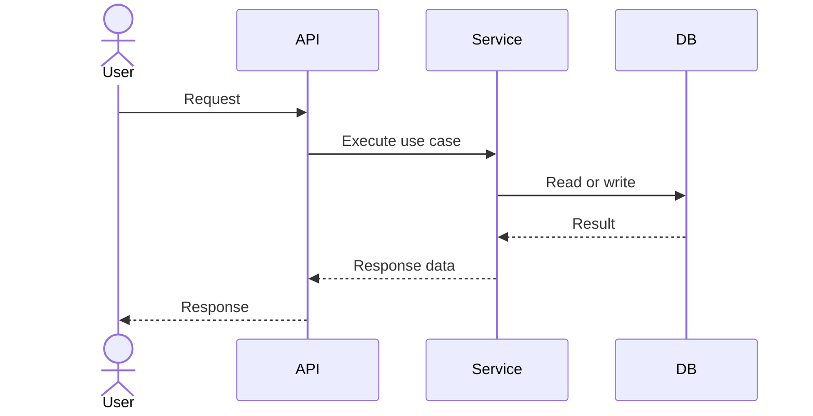

# API

このディレクトリは、現在の API 仕様を理解するための資料を置く場所です。

API を持たないプロジェクトでは、このファイルに「このプロジェクトでは API を提供しない」と書く。

## What To Write

- API の目的
- エンドポイント
- リクエスト
- レスポンス
- エラー
- 認証、認可
- API ごとの処理フロー
- 関連する画面、ジョブ、DB、外部サービス

## Documents

API が複数ある場合は、機能ごとにファイルを分ける。

| Document | Purpose |
| --- | --- |
| `example-feature.md` | 機能単位の API 仕様を書く |

## File Template

~~~md
# API: Name

## Status

Active

## Overview

## Flow

## Endpoints

| Method | Path | Purpose |
| --- | --- | --- |

## Request

## Response

## Errors

## Authorization

## Related Documents

- 
~~~

## Reading Flow

1. このファイルで API 全体の構成を確認する。
2. 対応する機能別 API ドキュメントを確認する。
3. DB 変更が関係する場合は `../database/` を確認する。
4. 処理構成が関係する場合は `../architecture/` を確認する。

## AI Update Rule

AI がエンドポイント、リクエスト、レスポンス、エラー、認可、API の処理フローを変更した場合は、このディレクトリを更新する。

1 つのファイルに全 API をまとめすぎず、機能単位で分ける。
