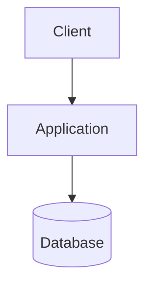

# Deployment Architecture

## Status

Draft

## Environments

| Environment | Purpose | Deployment Target |
| --- | --- | --- |

## Deployment Diagram

## Network and Ports

| Source | Destination | Protocol / Port | Purpose |
| --- | --- | --- | --- |

## Related Documents

- [Deployment Operation](../operations/deployment.md)
