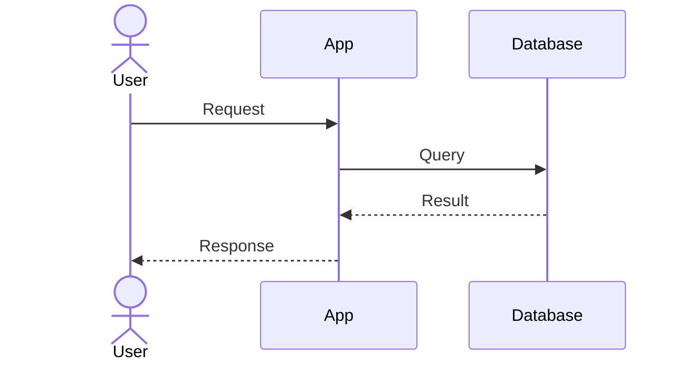

# Runtime Flow

## Status

Draft

## Overview

主要機能ごとの実行時フローを記載する。機能が増えた場合は見出しを追加し、詳細資料へリンクする。

## Main Flow

```mermaid
sequenceDiagram
    actor User
    participant App
    participant Database

    User->>App: Request
    App->>Database: Query
    Database-->>App: Result
    App-->>User: Response
```

## Related Documents

- [System Context](system-context.md)
- [API](../api/index.md)
