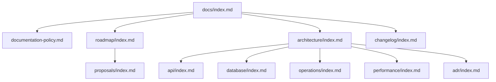

# Project Documentation

このファイルは、プロジェクト全体を理解するための入口です。

このテンプレートでは、AI がドキュメントを読んで現在状態を把握し、作業後にドキュメントを更新することを前提にしています。人は更新されたドキュメントを読んで状況を理解し、次の作業を AI に指示します。

## Purpose

このプロジェクトが何のために存在するかを書く。

例:

- 解決したい課題
- 作成するアプリケーション、検証環境、またはシステムの目的
- このリポジトリで管理する範囲

## Current Goal

現在の開発・検証のゴールを書く。

例:

- 直近で完成させたい機能
- 現在検証している技術テーマ
- どの状態になれば一区切りとみなすか

## Current Status

現在の状態を短く書く。

詳細は `roadmap/`、`architecture/`、`api/`、`database/`、`operations/`、`performance/` に分けて書く。

例:

- 完了していること
- 作業中のこと
- 未着手のこと
- 判断待ちのこと

## How To Read This Documentation

初めて読む場合は、以下の順番で確認する。

1. [Documentation Policy](documentation-policy.md)
2. [Roadmap](roadmap/index.md)
3. [Architecture](architecture/index.md)
4. [API](api/index.md)
5. [Database](database/index.md)
6. [Operations](operations/index.md)
7. [Performance](performance/index.md)
8. [ADR](adr/index.md)
9. [Proposals](proposals/index.md)
10. [Changelog](changelog/index.md)

API や DB を持たないプロジェクトでは、該当カテゴリの `index.md` に「このプロジェクトでは使用しない」と書く。

## Documentation Map

この図は、ドキュメント間の読み進め方を表す。プロジェクトに合わせて更新する。

## Main Documents

| Document | Purpose |
| --- | --- |
| [Documentation Policy](documentation-policy.md) | ドキュメント運用ルール |
| [Roadmap](roadmap/index.md) | 現在の開発状況と次にやること |
| [Architecture](architecture/index.md) | 現在のシステム構成 |
| [API](api/index.md) | 現在の API 仕様 |
| [Database](database/index.md) | 現在の DB 構造 |
| [Operations](operations/index.md) | 実行、デプロイ、監視、障害対応の手順 |
| [Performance](performance/index.md) | 性能設計、性能試験、ボトルネック分析 |
| [ADR](adr/index.md) | 確定した設計判断の履歴 |
| [Proposals](proposals/index.md) | 実装前の変更案 |
| [Changelog](changelog/index.md) | 実施済み変更履歴 |

## AI Update Rule

AI が作業する場合は、作業前にこのファイルから読み始める。

作業後は、変更内容に応じて以下を更新する。

| Change | Update |
| --- | --- |
| システム構成変更 | `architecture/` |
| API 変更 | `api/` |
| DB 変更 | `database/` |
| 実行・運用手順変更 | `operations/` |
| 性能検証・性能改善 | `performance/` |
| 設計判断 | `adr/` |
| 未実装の構想 | `proposals/` |
| 開発状況 | `roadmap/` |
| 実施済み変更 | `changelog/` |

Current State 文書には現在の状態だけを書く。過去の判断は ADR、未実装の構想は Proposal、実施済み変更は Changelog に分ける。
